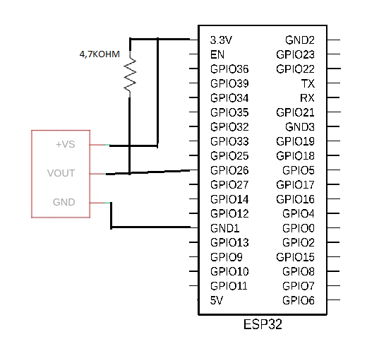

# Projeto feito em conjunto com: 

<div style="display: inline_block;" align="center">

<table>
  <tr>
    <td align="center">
      <a href="https://github.com/MatheusCarne" target="_blank">
        <br>
        <sub>
          <b>Matheus Carneiro</b>
        </sub>
      </a>
    </td>
    <td align="center">
      <a href="https://github.com/RafaelBerg" target="_blank">
        <br>
        <sub>
          <b>Rafael Berg</b>
        </sub>
      </a>
    </td>
    <td align="center">
      <a href="https://github.com/heitorbrunini" target="_blank">
        <br>
        <sub>
          <b>Heitor Brunini</b>
        </sub>
      </a>
    </td>
  </tr>
</table>

</div>

| Placas suportadas | ESP32 | ESP32-C3 | ESP32-C5 | ESP32-C6 | ESP32-C61 | ESP32-H2 | ESP32-S3 |
| ----------------- | ----- | -------- | -------- | -------- | --------- | -------- | -------- |

### Descrição do projeto

Esta biblioteca implementa a comunicação direta com o sensor DS18B20.

```
ds18b20_get_temperature(): Obtém a temperatura do sensor DS18B20.

ds18b20_reset(): Realiza um pulso de reset na linha OneWire para inicializar a comunicação com o sensor.

ds18b20_read_bit(): Lê um único bit do sensor DS18B20.

ds18b20_read_byte(): Lê um byte inteiro do sensor (LSB primeiro).

ds18b20_write_bit(): Escreve um único bit no sensor DS18B20.

ds18b20_write_byte(): Escreve um byte inteiro no sensor (LSB primeiro).
``` 

# Esquemático

